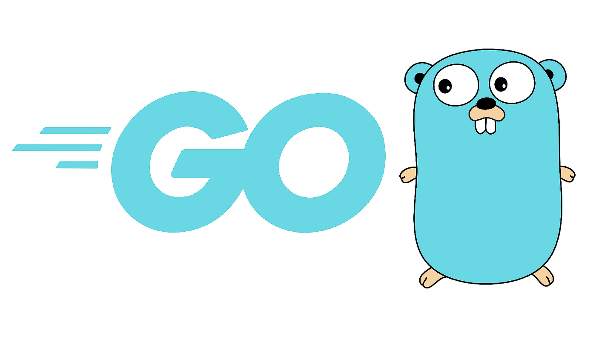

# GO API TEMPLATE

## Tools used:

*  sqlc **[CLI]**
*  golang-migrate **[CLI]**
*  viper
*  net/http (without framework) 

## Architecture (clean based)

::: mermaid
graph TD;
    %% Main structure
    subgraph App
        cmd["📦 cmd Main"] --> _main_files_["_main_files_"]
        configs["⚙️ Configs"] --> _config_files_["_config_files_"]
    end

    subgraph Domain
        internal["🏗️Internal"]
        internal --> presentation["🎨 Presentation"]
        internal --> usercases["📋 Use Cases"]
        internal --> repositories["📦 Repositories"]
    end

    subgraph Database
        sql["🗄️ SQL Layer"]
        sql --> migrations["📤 Migrations"]
        sql --> queries["📄 Queries"]
    end

    %% Additional layout improvements
    _main_files_ --> internal
    _config_files_ --> internal
    usercases --> queries
    repositories --> queries

:::
